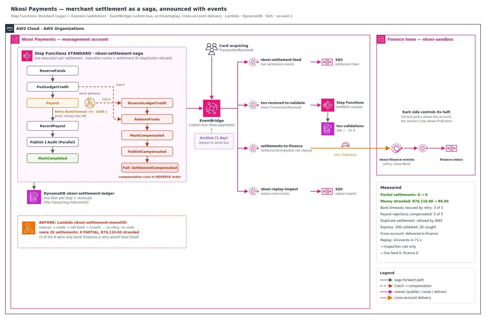

# Event-Driven Settlement: a Step Functions saga, EventBridge events, cross-account delivery and replay

Nkosi Payments settles its merchants every night: the money a merchant earned from card sales is paid into their bank account. The whole run was **one Lambda function** that reserved the funds, credited the merchant's ledger, called the bank, and marked the settlement complete. When the bank timed out or rejected a payout, the function crashed **after** the money was reserved and the ledger credited, but **before** anything was paid. Merchants were told they'd been paid when they hadn't. Finance spent two days matching ledgers to bank statements by hand, and nobody could say exactly which settlements were half-done.

I reproduced that failure, then replaced the function with a **saga**: a Step Functions workflow that retries what can be retried, and undoes what can't, in reverse order. Every result is announced as an event on an EventBridge bus, delivered across accounts to the finance team, and archived so it can be replayed.

**Headline results** (same 20 settlements, same bank failures, both designs):

| | Old single function | Saga |
|---|---|---|
| Settlements completed | 12 | **15** |
| Cleanly reversed | 0 | **5** |
| **Partial (money stuck mid-way)** | **8** | **0** |
| **Money stranded** | **R76,110.00** | **R0.00** |

- **All 3 bank timeouts were rescued by automatic retries.** The old function treated them as fatal, so they became partial settlements.
- **All 5 permanent rejections were undone** in reverse order: ledger credit reversed, reserved funds released.
- **Settling the same merchant twice is refused by AWS itself.** The settlement ID is the execution name, so a second start returns `ExecutionAlreadyExists`.
- **200 card transactions validated** by a lightweight Express workflow. All 20 bad ones were caught, each with its reason.
- **Settlement events reached the finance team's own AWS account**, through a bus policy on their side and an IAM role on ours.
- **24 archived events replayed in 71 seconds**, delivered only to an inspection queue. The live feed and finance received **0** duplicates.
- Built and torn down in both accounts the same day, for a few cents.



---

## The problem I was solving

> A settlement must end in exactly one of two states: fully done or fully undone, never half. A transient bank timeout must be retried, not allowed to kill the run. A permanent rejection must reverse the earlier steps. Other teams must learn what happened through events, not by reading our database. And when a consumer gets it wrong, we must be able to send yesterday's events again, without paying anyone twice.

This continues the Nkosi Payments story: `aws-multi-account-organizations` built the accounts, `aws-cross-account-access-patterns` controlled who can reach what across them, and `saa-serverless-transaction-api` gave merchants their transaction lookups. This project fixes what happens to the money at the end of the day.

---

## Four ideas the whole build depends on

1. **A saga replaces one big transaction with steps that each have an undo.** Reserve funds (undo: release), credit the ledger (undo: reverse), pay out. If a step fails, the completed steps are undone in **reverse order**. There's no distributed lock, just a guaranteed way back.
2. **Retry what's transient, compensate what's permanent.** A bank timeout is worth retrying with backoff. A closed beneficiary account will never succeed, so retrying only delays the undo. Step Functions separates the two: `Retry` on `BankTimeout`, `Catch` on everything else.
3. **The pivot.** Once the payout has gone, the money has left the building, and you can't "undo" it by writing to a table. Steps after the pivot (publishing the event, writing the audit record) are **retried, never compensated**.
4. **Events, not shared databases.** Finance doesn't read Nkosi's ledger; Nkosi doesn't call finance's systems. Nkosi publishes `SettlementCompleted` to a bus, and each consumer decides what to do with it, in its own account.

---

## Architecture decisions

| Requirement | Decision | Why |
|---|---|---|
| Never half-settled | **Step Functions Standard saga** with compensation in reverse order | Durable, exactly-once per execution, 90 days of step-by-step history for audit |
| Survive bank timeouts | `Retry` on `BankTimeout`, 3 attempts, backoff 2 → 4 → 8 s | Transient faults become delays, not incidents |
| Permanent failure stops cleanly | `Catch` → `ReverseLedgerCredit` → `ReleaseFunds` → `MarkCompensated` | Every forward step has a matching undo |
| Never settle twice | **Execution name = settlement ID** | Standard workflows refuse a second execution with the same name for 90 days |
| Simple writes without code | Direct **DynamoDB and EventBridge integrations** | Only the bank call needs a Lambda; fewer functions to secure and patch |
| Validate every card transaction | **Step Functions Express**, triggered by EventBridge | High volume, short, cheap; no per-execution history needed |
| Tell other teams | **EventBridge custom bus** `nkosi-payments` | Content-based routing, cross-account delivery, archive and replay |
| Finance in its own account | **Cross-account bus delivery**: their bus policy + our IAM role | Each side controls its own half of the connection |
| Re-send yesterday's events safely | **Archive + replay** routed only to an inspection rule | Replays can't reach live consumers by accident |

Long-form reasoning is in [`docs/adr/`](docs/adr). The architecture diagram uses the **official AWS Architecture Icons** and is generated from [`docs/diagram/build_architecture.py`](docs/diagram/build_architecture.py). The icon pack itself isn't committed: AWS licenses it for diagrams, not redistribution. Point `AWS_ICONS_DIR` at your own download to regenerate.

---

## How I measured it

Every step in both designs writes one item to the DynamoDB table `nkosi-settlement-ledger`: `RESERVE`, `LEDGER_CREDIT`, `PAYOUT`, `AUDIT`, `STATUS`, and the reversals `LEDGER_REVERSED` and `RESERVE_RELEASED`. [`scripts/check_ledger.py`](scripts/check_ledger.py) then classifies every settlement in a run:

- **COMPLETE**: reserve + credit + payout all present.
- **COMPENSATED**: no payout, and every forward step has its reversal.
- **PARTIAL**: anything else. Money reserved or credited with no payout and no reversal. That was last month's incident.

Both designs ran the **identical** 20-settlement batch from [`scripts/run_settlements.py`](scripts/run_settlements.py). Every 4th payout is rejected permanently (5), every 5th times out twice before the bank answers (3), and the other 12 are clean.

| Run | Design | Complete | Compensated | Partial | Stranded |
|---|---|---|---|---|---|
| `MONO` | single Lambda | 12 | 0 | **8** | **R76,110.00** |
| `SAGA` | Step Functions saga | 15 | 5 | **0** | **R0.00** |
| `DEMO` | one of each path | 2 | 1 | 0 | R0.00 |
| `XACCT` | cross-account proof | 1 | 0 | 0 | R0.00 |

Evidence: [`02`](docs/screenshots/02-step1-monolith-batch-8-partial-settlements.png), [`11`](docs/screenshots/11-step7-saga-batch-zero-partial-vs-monolith.png), [`24`](docs/screenshots/24-step11-all-measurements.png).

---

## What I proved

| Test | Result | Evidence |
|---|---|---|
| Baseline: the old function under bank failures | ✅ 8 crashed mid-run; 8 PARTIAL, R76,110.00 stranded | [`01`](docs/screenshots/01-step1-ledger-table-and-monolith-deployed.png), [`02`](docs/screenshots/02-step1-monolith-batch-8-partial-settlements.png) |
| Saga definition checked before deploying | ✅ AWS validator: `OK`, no problems | [`04`](docs/screenshots/04-step4-saga-validated-and-created.png) |
| Happy path | ✅ `SUCCEEDED`, bank ref `…-A1` (first attempt) | [`05`](docs/screenshots/05-step5-three-demo-settlements-started.png), [`06`](docs/screenshots/06-step5-completed-retried-compensated.png), [`09`](docs/screenshots/09-step5-console-graph-happy-path.png) |
| Transient bank timeout | ✅ `BankTimeout`, `BankTimeout`, then `SUCCEEDED` on attempt 3 (`…-A3`) | [`06`](docs/screenshots/06-step5-completed-retried-compensated.png), [`07`](docs/screenshots/07-step5-retries-compensation-path-ledger-feed.png) |
| Permanent rejection | ✅ `Payout → ReverseLedgerCredit → ReleaseFunds → MarkCompensated`; execution `FAILED: SettlementCompensated`; ledger consistent | [`07`](docs/screenshots/07-step5-retries-compensation-path-ledger-feed.png), [`08`](docs/screenshots/08-step5-console-graph-compensation.png) |
| Events for each outcome | ✅ 2 × `SettlementCompleted`, 1 × `SettlementCompensated` on the live feed | [`07`](docs/screenshots/07-step5-retries-compensation-path-ledger-feed.png) |
| Duplicate settlement | ✅ `ExecutionAlreadyExists` | [`10`](docs/screenshots/10-step6-duplicate-settlement-refused.png) |
| **The batch, through the saga** | ✅ **15 completed, 5 compensated, 0 partial**; the timeouts took ~7.1 s (the backoff) vs ~0.8 s for a clean settlement | [`11`](docs/screenshots/11-step7-saga-batch-zero-partial-vs-monolith.png), [`12`](docs/screenshots/12-step7-console-executions-list.png) |
| Express validation | ✅ 200 / 200 recorded; 180 accepted; 20 rejected: 5 wrong currency, 5 non-positive amount, 5 bad merchant ID, 5 missing field | [`13`](docs/screenshots/13-step8-validation-table-express-validated.png)–[`16`](docs/screenshots/16-step8-200-transactions-validated.png) |
| Cross-account delivery | ✅ `S-XACCT-0001` arrived in the finance account's queue, "from" Nkosi's account | [`17`](docs/screenshots/17-step9-finance-account-queue-rule-target.png), [`18`](docs/screenshots/18-step9-cross-account-delivery-proven.png) |
| **Archive replay** | ✅ 24 events (18 completed, 6 compensated) replayed in **71 s**, each tagged `replay-name: nkosi-replay-1` | [`19`](docs/screenshots/19-step10-replay-inspection-rule.png)–[`22`](docs/screenshots/22-step10-24-events-replayed-to-inspection-only.png) |
| Replay stayed contained | ✅ Live feed 0, finance inbox 0; `FilterArns` limited delivery to the inspection rule, which only matches settlement events | [`23`](docs/screenshots/23-step10-live-feed-and-finance-untouched.png) |
| Teardown, both accounts | ✅ Every clean-check query empty | [`25`](docs/screenshots/25-step12-clean-check-both-accounts.png) |

**Build evidence** (the infrastructure behind the tests):

| Component | Evidence |
|---|---|
| Custom bus `nkosi-payments`, 1-day archive, live-feed rule → SQS (policy allows that rule only) | [`03`](docs/screenshots/03-step2-bus-archive-and-live-feed.png) |
| Express state machine `nkosi-txn-validate` | [`14`](docs/screenshots/14-step8-express-workflow-created.png) |
| EventBridge role (start the validator, deliver to finance) + validation rule and target | [`15`](docs/screenshots/15-step8-eventbridge-role-rule-target.png) |

Walkthroughs: [`docs/saga-design.md`](docs/saga-design.md), [`docs/express-validation.md`](docs/express-validation.md), [`docs/cross-account-events.md`](docs/cross-account-events.md) and [`docs/archive-and-replay.md`](docs/archive-and-replay.md).

---

## The replay, and why it can't pay anyone twice

The realistic scenario: finance's reconciliation job had a bug for a day and dropped events. Once it's fixed, they need that day's events again. Re-running the settlements would pay merchants a second time. Replaying the **events** doesn't.

Two AWS facts shaped the design, and I checked both in the documentation before building:

1. **A replay can only go back to the bus the archive belongs to.** There's no "replay into a test bus". Isolation has to come from routing.
2. **Replayed events carry a `replay-name` field.** Rules can match on its presence or absence.

So every live rule matches `"replay-name": [{"exists": false}]`, the inspection rule matches `"exists": true`, and the replay's `FilterArns` names **only** the inspection rule. The result:

| Queue | Events during replay |
|---|---|
| `nkosi-replay-inspect` | **24**, all `replay-name: nkosi-replay-1` |
| `nkosi-settlement-feed` (live) | **0** |
| `nkosi-finance-inbox` (other account) | **0** |

The replay covered 11:56:00 to 13:15:54 UTC, ended 10 minutes before it started (AWS recommends that delay so late events reach the archive), and ran for 71 seconds. Details: [`docs/archive-and-replay.md`](docs/archive-and-replay.md).

---

## Debugging along the way

The build ran clean first time. Every block worked as designed. These are the judgement calls that kept it that way:

- **The replay plan changed when I checked the docs.** The original idea, replaying into a separate test bus, isn't something EventBridge supports. I redesigned the isolation around `replay-name` patterns and `FilterArns` before creating anything.
- **I cleared the live feed before the replay.** Steps 7 and 9 had left 21 live events in it. Without clearing them, the "after" check would have shown 21 events and looked like the replay had leaked.
- **Express keeps no execution list.** `list-executions` returns `StateMachineTypeNotSupported` for Express workflows, so I designed the validator to record every outcome in DynamoDB from the start.
- **I didn't trust the archive's `EventCount`.** AWS reconciles that counter over 24 hours. The replay result was my evidence, not the counter.
- **IAM propagation never bit.** Every "create role → use role" sequence had a `sleep 10` chained in, so nothing hit "role cannot be assumed".

Full notes: [`docs/debugging-journey.md`](docs/debugging-journey.md).

---

## Cost

Everything here bills per use; nothing bills by the hour.

| Item | Usage | Approx. cost |
|---|---|---|
| Step Functions Standard | 24 executions, ~250 state transitions | free tier (4,000/month) |
| Step Functions Express | 200 short executions | < US$0.01 |
| Lambda | ~50 invocations | free tier |
| EventBridge | a few hundred custom events + cross-account delivery + 24 replayed | < US$0.01 |
| Archive | a few KB for a day | < US$0.01 |
| DynamoDB on-demand, SQS | a few hundred writes and messages | < US$0.01 |
| **Total** | | **a few cents** |

Cost Explorer showed `-US$0.00` on build day ([`26`](docs/screenshots/26-step12-cost-explorer-same-day.png)). Billing data is refreshed at least once every 24 hours, so the cents appear the next day. Details: [`docs/cost-model.md`](docs/cost-model.md).

---

## Compliance & frameworks

For a payments company, "never half-settled, always traceable, replayable without re-paying" isn't just engineering hygiene. It's what these frameworks require:

- **PCI DSS v4.0**
  - **Req 10.2 / 10.3**: audit logs of events, protected from alteration. Every settlement has a 90-day step-by-step execution history plus `AUDIT` records.
  - **Req 7.2**: least privilege. Five roles, each scoped to one table, one function, one bus or one state machine.
- **SOC 2 (AICPA Trust Services Criteria)**
  - **PI1 Processing Integrity**: complete, accurate processing, evidenced by the per-run COMPLETE / COMPENSATED / PARTIAL counts.
  - **CC7.4 / CC7.5**: responding to and recovering from processing failures, through compensation and replay.
- **NIST SP 800-53 Rev. 5**
  - **AU-2, AU-3, AU-12**: event logging and audit record content.
  - **SI-10**: input validation. Every card transaction is checked before it's trusted.
  - **CP-10**: system recovery and reconstitution, through retry, compensation and replay.
  - **AC-4**: information flow enforcement. Event patterns keep replays out of live consumers and send only `SettlementCompleted` across the account boundary.
  - **AC-6**: least privilege.
- **NIST Cybersecurity Framework 2.0**
  - **PR.DS**: data integrity of the settlement ledger.
  - **PR.PS-04**: log records generated and available for monitoring.
  - **PR.AA-05**: least-privilege access permissions.
- **ISO/IEC 27001:2022 Annex A**
  - **A.5.14 Information transfer**: a defined, policy-controlled channel to the finance account.
  - **A.8.15 Logging**
  - **A.8.16 Monitoring activities**
  - **A.5.15 Access control**
- **POPIA §19 (South Africa)**: integrity safeguards for merchants' financial information.

---

## Repo layout

```
.
├── README.md
├── env.sh.example                       # copy to env.sh (git-ignored); saved IDs + the save() helper
├── statemachines/
│   ├── settlement-saga.asl.json         # STANDARD: reserve, credit, payout (pivot), notify ‖ audit, compensation
│   └── txn-validate.asl.json            # EXPRESS: ordered Choice rules, direct DynamoDB writes
├── lambda/
│   ├── bank_gateway.py                  # simulated bank: ok / transient (fails twice) / payout_fail
│   └── settlement_monolith.py           # the "before": no retry, no undo
├── scripts/
│   ├── run_settlements.py               # the identical 20-settlement batch through either design
│   ├── check_ledger.py                  # the measurement: COMPLETE / COMPENSATED / PARTIAL + money stranded
│   ├── publish_txns.py                  # TransactionReceived events, 10 per PutEvents call
│   ├── count_validations.py             # what the Express workflow recorded
│   ├── peek_queue.py                    # read + summarise events waiting in a queue
│   ├── watch_replay.py                  # poll a replay and time it
│   ├── apply_queue_policy.py            # let exactly one EventBridge rule send to a queue
│   ├── ensure_profile.py                # add a member-account CLI profile only if it's missing
│   ├── render.py                        # fills @@NAME@@ placeholders; refuses to leave any empty
│   └── kit_aws.py                       # shared AWS CLI helper
├── policies/                            # trust policies, 4 least-privilege templates, 5 event patterns,
│                                        # the replay destination template
└── docs/
    ├── architecture.png / .svg          # official AWS Architecture Icons
    ├── diagram/                         # build_architecture.py + awsdiag.py
    ├── saga-design.md
    ├── express-validation.md
    ├── cross-account-events.md
    ├── archive-and-replay.md
    ├── debugging-journey.md
    ├── cost-model.md
    ├── teardown.md
    ├── adr/                             # 6 architecture decision records
    └── screenshots/                     # 26 build, drill and teardown screenshots, in order
```

> **No account IDs are committed.** Templates use `@@NAME@@` placeholders filled at run time from values saved in `env.sh`. There is no `Deny` statement anywhere in the project.

---

## Reproduce it

From WSL, in `us-east-1`, with a second account in the same Organization for the finance side:

1. From the repo folder: `cp env.sh.example env.sh && mkdir -p build && source env.sh`
2. `python3 scripts/ensure_profile.py finance-admin <finance-account-id>`, then save `ACCOUNT_ID` and `FIN_ACCOUNT_ID`.
3. **Before:** ledger table + `settlement_monolith.py` (role from `monolith-perms.json.tpl`), then `run_settlements.py MONO 20 --mode monolith` and `check_ledger.py MONO`.
4. Event bus `nkosi-payments` + archive + the live-feed rule → SQS.
5. `bank_gateway.py` Lambda; validate and create `settlement-saga.asl.json` with the role from `saga-perms.json.tpl`.
6. Three demo settlements (ok / transient / payout_fail); re-start one to see `ExecutionAlreadyExists`.
7. `run_settlements.py SAGA 20 --mode saga` and `check_ledger.py SAGA`.
8. Validation table + `txn-validate.asl.json` (EXPRESS) + the EventBridge role and rule; `publish_txns.py VAL 200`; `count_validations.py VAL 200 --wait`.
9. Finance account: bus + `put-permission` + queue + rule. Nkosi account: rule → finance bus with the role.
10. After a 10-minute wait: the inspection rule + queue, clear the live feed, `start-replay` with `replay-destination.json`, then `watch_replay.py`.
11. Teardown in both accounts: [`docs/teardown.md`](docs/teardown.md).

---

## What this connects to

- `aws-cross-account-access-patterns`: the same both-sides rule, now for events. The finance bus policy allows the account, and our role allows `PutEvents`.
- `aws-decoupled-order-pipeline`: that project decoupled with queues (choreography by messages). This one adds orchestration for a process that needs a single, auditable controller.
- `saa-serverless-transaction-api`: the merchant-facing API over the same Nkosi transactions. Settlement is what happens to that money at night.
- `aws-cloudtrail-config-governance`: Step Functions execution history is the business-level audit trail; CloudTrail is the API-level one. Together they answer "who changed what" and "what happened to this settlement".
